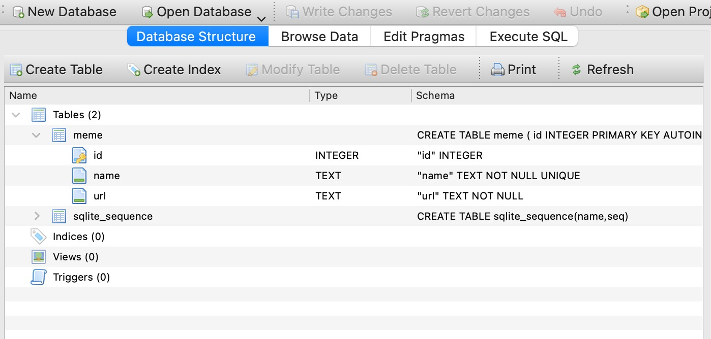

# Exercice : Ajout d'une base de données sqlite

## Introduction

Dans cet exercice, nous allons remplacer notre "fausse" base de données par une base de données sqlite.

## Découverte sqlite

Dans un premier temps, lisez `docs/sqlite_guide.md` pour vous familiariser avec la techno sqlite.

Puis regardez le code du dossier `examples/memes`.

Avec votre terminal, rendez vous dans ce dossier `examples/memes`.

Lancez la commande : `python3 create_db.py`

La DB `memes.sqlite` a du se crée dans le dossier.

Utilisez db-browser-for-sqlite pour visualiser cette BD.

- Sous mac : `brew install db-browser-for-sqlite`
- Sous linux : `sudo apt-get install sqlitebrowser`
- Sous windows : <https://github.com/sqlitebrowser/sqlitebrowser/releases/download/v3.13.1/DB.Browser.for.SQLite-v3.13.1-win64.msi>
- sinon : https://sqlitebrowser.org/dl/

Vous devriez voir la structure de la table.

Executez maintenant : `python3 memes.py`

Retournez dans DB browser for SQlite et cliquez sur l'onglet `Browse Data`.

Vous devriez désormais voir des données inscrites.

## Exercice

En vous inspirant de cet exemple de `memes`, modifier votre projet pour remplacer la fausse db in-memory par une db sqlite.

1. Creez à la racine de votre projet un fichier `create_db.py` qui se chargera de creer la DB et ses tables. Il faudra donc imaginer le SQL necessaire pour créer la table des utilisateur `users`.
2. Modifiez le fichier `src/db.py` pour remplacer le dictionnaire par une fonction qui renvoie une connexion à la base de données.
3. Créez un dossier `src/services`, avec un fichier vide `__init__.py` + un fichier `users.py` qui contiendra toutes les fonctions utiles pour manipuler nos utilisateurs. On peut donc penser à une fonction pour créer un nouvel utilisateur en base, et une fonction pour aller récupérer un utilisateur en base. On peut aussi imaginer une fonction qui verifie uniquement si un utilisateur existe, sans aller récupérer ses infos.
4. Modifiez `src/auth.py` pour utiliser ces nouvelles fonctions.
5. (bonus) extraire le schéma SQL dans un fichier à part pour la création de la DB.
6. (bonus) rajouter les champs `created_at`, et `updated_at` à la table users de manière à ce qu'ils soient mis automatiquement à jour.

Lancez votre app et testez le workflow register + login fonctionne ;)

## Correction

cf. le code :)
