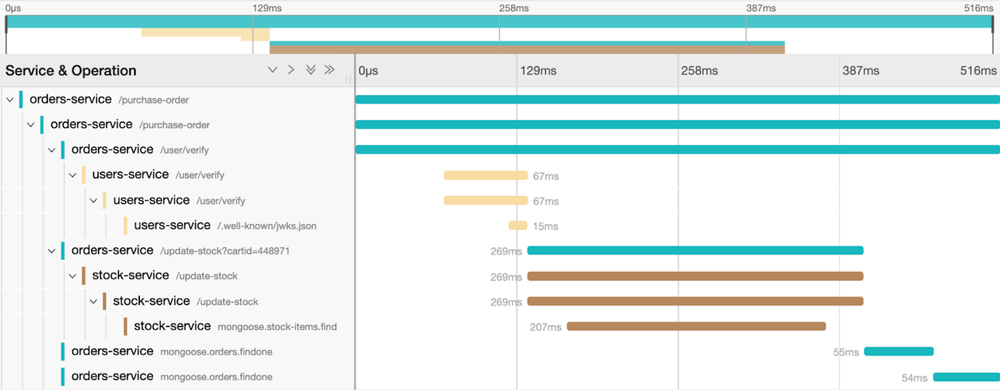

# TP 7 : Logs

Dans ce TP nous allons mettre en place des logs.

## Les logs : concepts fondamentaux

### À quoi servent les logs ?

Les logs servent à **comprendre ce qui s'est passé** dans un système, après coup ou en temps réel :

- **Débug** : reproduire un bug à partir des traces laissées.
- **Audit** : qui a fait quoi, quand.
- **Monitoring** : détecter des comportements anormaux.
- **Alerting** : déclencher une alerte quand un niveau d'erreur est atteint.
- **Metrics** : combien de scans ont été lancés.

### Les niveaux de log

Les niveaux sont une convention pour indiquer la sévérité d'un message.

Il existe 2 écoles :

- une qui pense qu'un log ne doit exister que pour me dire que quelque chose d'innatendu et critique est en cours. Pas de niveau necessaire.

cf. <https://sobolevn.me/2020/03/do-not-log>

- une autre qui pense que plusieurs niveaux sont nécessaires :

Du plus bas au plus élevé :

`DEBUG` : Détails de développement, traces internes
`INFO` : Événements normaux du flux d'exécution
`WARNING` : Situation inattendue mais non bloquante
`ERROR` : Erreur qui empêche une opération
`CRITICAL` : Erreur grave mettant en danger le système

En production, on filtre généralement à `INFO` ou `WARNING`. En développement, on passe à `DEBUG`.

Même si la première école est minoritaire, je vous invite à l'étudier et vous questionner.

Il convient de se poser cependant LA question : à partir de quel niveau je me fais reveiller à 3h du mat pour debug le système ?

Et la question qui suit, si je me fais reveiller à 3h du mat, quelles infos ai-je envie d'avoir dans mon log ?

### Qu'est-ce qu'un bon log ?

Un bon log répond à ces questions : **quoi, quand, où, avec quel contexte ?**

**À mettre dans un log :**

- Un événement nommé clairement (ex: `port_open`, `user_login_failed`), on appelle souvent cette information la clé, `key`, `log_key`
- Des données structurées plutôt que du texte
- Tout le contexte nécessaire à la compréhension (identifiants, paramètres clés)

**À éviter :**

- Les données sensibles (mots de passe, tokens, données personnelles)
- Les messages vagues (`"Erreur !"`, `"Quelque chose a mal tourné"`)
- La duplication excessive (logger la même chose à 5 endroits)
- Les logs trop verbeux qui noient les informations importantes

Mauvais exemple avec une succession d'`Exception` :

```python
def a():
    if something:
        ...
    else:
        log("something bad happens")
        raise ValueError()

def b():
    try:
        a()
    except ValueError as e:
        log("something bad happened")
        raise CustomException()
```

Ici on a 2 logs similaires, puisqu'avant chaque raise on log.

On preferera toujours logger aux "bordures", c'est à dire le plus tard possible dans la chaine d'execution.

Par exemple dans le cas d'une application web, on essaiera de logger avant que la réponse ne reparte au client.

**Exemple de mauvais log :**

```python
log.info(f"Scanning ...")
```

**Exemple de bon log :**

```python
log.info("scan_failed", host=host, port=port, error="e")
```

La version structurée est directement filtrable et indexable dans n'importe quel outil d'agrégation.

Il vous revient la décision de logger ce que l'on appelle le `happy path`. Est-ce qu'un log qui dit `tout va bien` est utile en production ?

---

## Les limites de `print`

La fonction `print` semble suffisant pour suivre ce qui se passe dans un programme :

```python
print("Scan démarré")
print(f"Port {port} ouvert sur {host}")
print("Erreur : connexion refusée")
```

Mais généralement, on souhaite avoir un peu + d'infos qu'un simple message. Par exemple, l'heure précise à laquelle le log a été émis.

Cela necessite soit à chaque fois de rajouter l'heure :

```python
print(f"{datetime.now()}: Scan démarré")
print(f"{datetime.now()}: Port {port} ouvert sur {host}")
print(f"{datetime.now()}: Erreur : connexion refusée")
```

ou bien on factorise dans une fonction dédiée :

```python
def print_log(msg: str):
    print(f"{datetime.now()}: {msg})

print_log("Scan démarré")
print_log(f"Port {port} ouvert sur {host}")
print_log("Erreur : connexion refusée")
```

Cela nous fait une fonction de + à maintenir.

Imaginons maintenant que je fais 10 000 scans. Tous les logs n'ont pas le même niveau d'importance. Si je souhaite afficher uniquement les logs "critiques", je vais donc devoir implémenter un système pour différencier ce cas.

```python
LOG_SEVERITY_TO_PRINT = "critical"

class LogSeverities(Enum):
    INFO: "info"
    CRITICAL: "critical"

def print_log(severity: LogSeverities, msg: str):
    if severity == LOG_SEVERITY_TO_PRINT:
        print(f"{datetime.now()}: {msg})
```

On se retrouve à devoir gérer de + en + de cas, et à recoder quelque chose qui existe déjà...

Au final, la fonction `print` seule :

- **Pas de niveau de sévérité** : impossible de distinguer un message informatif d'une erreur critique.
- **Pas d'horodatage** : heure précise du log ?
- **Pas de contexte structuré** : le texte libre est difficile à filtrer ou à indexer. Si je veux faire ingérer mes logs par un outil dédié à leur lecture et parcours, le format "mono string" n'aide pas et ne nous permettra pas de filtrer par exemple sur une expression à l'intérieur de nos logs.
- **Destination limitée** : print envoie par défaut dans `stdout`, et n'accepte qu'un `stream` comme autre sortie.
- **Impossible à désactiver sélectivement** : pour ne pas afficher les messages de debug en prod, il faut soit les `print` à la main, soit coder un système de niveau de criticité.
- **Formatage string imposé** : le format de sortie des éléments `printés` est lié à la méthode `__str__`.

---

## Logs structurés

Un log "classique" est une simple chaîne de caractères :

```text
2026-04-02T10:00:00Z Scan terminé sur 192.168.1.1 port 80 ouvert en 120ms
```

C'est lisible pour un humain, mais difficile à exploiter automatiquement. Si on veut retrouver tous les scans qui ont pris plus de 100ms, il faut parser du texte (regex et compagnie, clairement pas simple ni robuste).

Un log **structuré** représente le même événement comme un ensemble de champs clé-valeur :

```json
{"timestamp": "2026-04-02T10:00:00Z", "event": "port_open", "host": "192.168.1.1", "port": 80, "duration_ms": 120}
```

## structlog

[`structlog`](https://www.structlog.org/) est une librairie de logging structuré en Python.

Les logs sont des **dictionnaires**, pas des chaînes de caractères.

### Pourquoi utiliser structlog ?

- **Logging structuré par défaut** : chaque log est un événement avec des champs clé-valeur.
- **Pipeline de processeurs configurable** : on peut enrichir, filtrer, reformater les logs à la chaîne.
- **Rendu adapté au contexte** : en mode dev les logs sont affichés de manière lisible par un humain, et en production ils sont formattés en json pour être ingérés par une machine.
- **Context variables** : permet de propager du contexte (ex: un ID de requête) sans le passer à la main.

Utilisation en mode **dev** (`debug=True`), la sortie est colorée et lisible :

```text
2026-04-02T10:00:00Z [info     ] port_open  host=192.168.1.1 port=80
```

En utilisation en mode **prod** (`debug=False`), la sortie est du JSON, directement ingérable par un agrégateur (type ELK ou grafana) :

```json
{"timestamp": "2026-04-02T10:00:00+00:00", "level": "info", "event": "port_open", "host": "192.168.1.1", "port": 80}
```

### Utilisation dans le code

```python
import structlog

log = structlog.get_logger(__name__)

log.info("scan_complete", host="192.168.1.1", port=80, status="open")
log.warning("port_closed", host="192.168.1.1", port=443, error="Connection refused")
```

La variable magique `__name__` permet de savoir dans quel module le log a été émis, ce qui permet de différencier les modules plus facilement.

### "Logs structurés comme événements métier"

Une approche plus moderne : ne logger que les événements qui ont une signification métier (`user_registered`, `scan_completed`, `payment_failed`). Chaque log devient une source de vérité sur ce qui s'est passé dans le système.

**Avantage** : logs directement exploitables par les outils d'analyse, alignés avec le domaine.
**Inconvénient** : nécessite une discipline de nommage et de conception.

---

## Observabilité : logs, métriques, tracing

L'**observabilité** désigne la capacité à comprendre l'état interne d'un système à partir de ses sorties. Elle repose sur trois piliers complémentaires :

### Logs

Des **événements inscrits** dans le temps. Chaque ligne de log décrit quelque chose qui s'est passé à un instant précis.

> "À 10h42, l'utilisateur `alice` a tenté de se connecter et a échoué."

Utile pour le debug et l'audit. Peuvent devenir volumineux et coûteux à stocker. Il faudra veiller à réfléchir à un `cycle de vie de la donnée`, qui passe notamment par la mise en place d'une durée de rétention maximum. Elle devra s'adapter à vos cas d'usage. Pour des logs non judiciaires ou sensibles, on retrouve généralement une durée allant de 3 à 12 mois. Tout dépendra notamment de la volumétrie que cela représente.

### Métriques

Des **valeurs numériques agrégées** dans le temps. Elles répondent à des questions du type "combien" et "à quelle fréquence".

> "100 requêtes par seconde, latence p99 = 250ms, taux d'erreur = 0.3%"

Idéales pour le monitoring et les alertes. Par exemple "il y a eu 50 erreurs 500 en moins d'une minute" ce qui signifierait qu'une brique logicielle est clairement en panne.

Outils connus : Prometheus, Datadog, Grafana, Jaeger.

### Tracing distribué

Le **suivi d'une requête** à travers plusieurs services. Chaque service ajoute une "span" à une trace globale.

> "La requête `abc-123` a mis 320ms : 10ms dans le service auth, 280ms en base de données, 30ms dans le service email."

Indispensable dans les architectures microservices. Outils courants : Jaeger, Zipkin, OpenTelemetry.

Voici un exemple visuel de tracing :



Cela permet visuellement de voir qu'ici, la requête de mongoose (un ORM pour mongodb) met + de 200 ms à répondre.

### Le triangle de l'observabilité

Ces trois piliers sont complémentaires. Les métriques vous disent *qu'il y a un problème*, les logs vous disent *ce qui s'est passé*, et le tracing vous montre *où* dans le système.

---

## TLDR

- Les logs servent à comprendre ce qui s'est passé : debug, audit, monitoring, alerting.
- `print` ne scale pas : pas de niveau, pas d'horodatage, pas de structure, pas de filtrage.
- Utilisez `structlog` : logs structurés (clé-valeur), pipeline configurable, JSON en prod / lisible en dev.
- Nommez vos événements comme des processus métier : `scan_completed`, `port_open`, `login_failed`.
- Loggez aux **bordures** (juste avant de répondre au client), pas à chaque couche intermédiaire.
- N'incluez jamais de données sensibles (mots de passe, tokens).
- En prod, filtrez à `INFO` ou `WARNING` — `DEBUG` reste pour le développement.
- Les logs ne sont qu'un pilier de l'observabilité : complétez avec des **métriques** (combien ?) et du **tracing** (où ?).

**Heuristiques :**

1. Pour chaque log, le message doit être unique et court.
2. Pour chaque log, demandez si quelqu'un le lira un jour. Si non, supprimer.
3. Pour chaque log critiques, imaginez vous à 3h du matin en train de le lire, avez-vous tout le contexte necessaire pour debugger efficacement ?

## Ressources

- <https://thomshutt.com/opinionated-logging-in-go.html>
- <https://guicommits.com/how-to-log-in-python-like-a-pro/>
